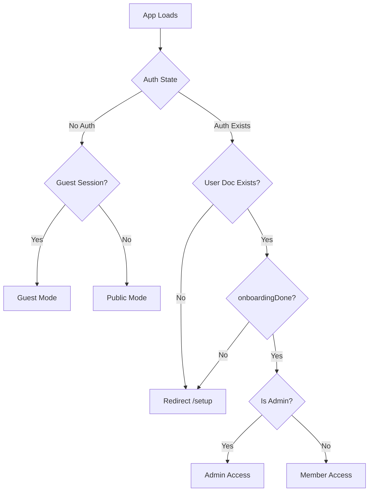
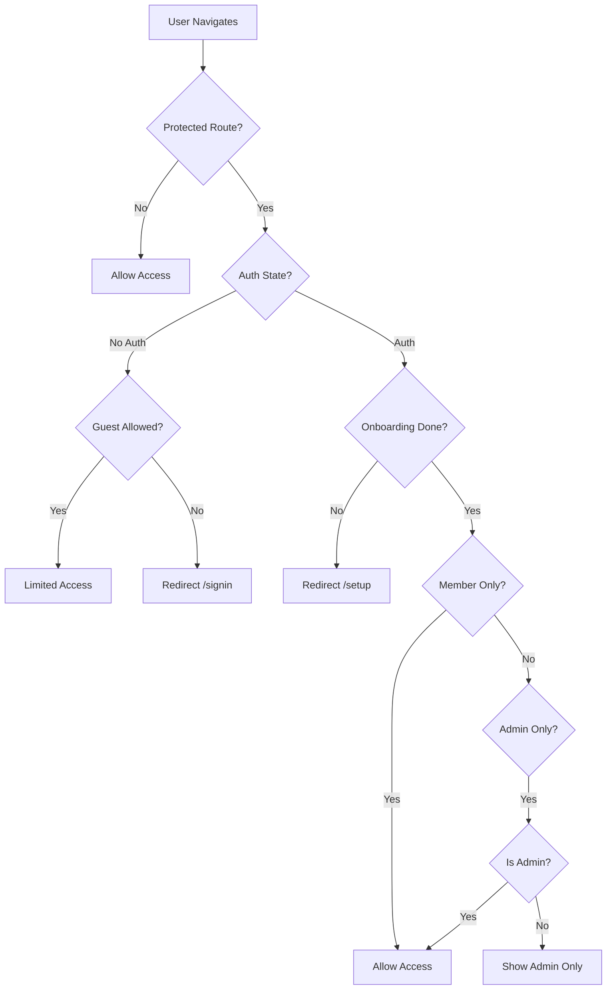

# Sai SMS by SSIOM - Complete Site Map
**Version**: 1.0  
**Last Updated**: 2026-02-16  
**Status**: Production Ready

---

## Table of Contents
1. [Public Zone](#public-zone)
2. [Member Zone](#member-zone)
3. [Guest Zone](#guest-zone)
4. [Admin Zone](#admin-zone)
5. [Hidden System Components](#hidden-system-components)
6. [Route Access Matrix](#route-access-matrix)
7. [Authentication Gates](#authentication-gates)

---

## A. Public Zone (Unauthenticated)

**Goal**: Allow browsing + teaser access. No personal data persistence.

### Routes

| Route | Page | Access | Description |
|-------|------|--------|-------------|
| `/` | Home (Landing) | Public | Landing page with national stats, event highlights, feature overview |
| `/signin` | Sign In | Public | Google Sign-In + Guest entry |
| `/signup` | Sign Up | Public | Google Sign-Up + Guest entry with modal |
| `/announcements` | Announcements Feed | Public | Read-only national announcements |
| `/calendar` | Events Calendar | Public | Read-only SMS events calendar |
| `/terms` | Terms of Use | Public | Legal terms and conditions |
| `/privacy` | Privacy Policy | Public | Data privacy policy |
| `/cookies` | Cookie Policy | Public | Cookie usage policy |
| `/copyright` | Copyright Notice | Public | Copyright information |
| `/community-guidelines` | Community Guidelines | Public | Community behavior standards |
| `/submission-guidelines` | Content Submission Guidelines | Public | Guidelines for content submission |

### Public Access Rules

**Can Read**:
- National rollup counts (read-only aggregated data)
- Announcements feed (all announcements)
- Calendar events (all events)
- Legal pages (all policy documents)

**Cannot**:
- Write any data
- Access personal dashboards
- Save progress or streaks
- Earn badges
- Participate in moderated activities

---

## B. Member Zone (Authenticated)

**Goal**: Full participation + saved progress + streaks + badges.

### Routes

| Route | Page | Access | Description |
|-------|------|--------|-------------|
| `/dashboard` | Personal Dashboard | Members Only | Personal stats, streaks, badges, milestones |
| `/namasmarana` | Namasmarana Tracker | Members Only | Gayathri + Sai Gayathri + Likitha Japam + offline queue sync |
| `/book-club" | Sai Lit Club | Members Only | Journey Map (grid) + Reader/Classroom (state-driven) |
| `/journal` | Spiritual Journal | Members Only | Private personal journal entries |
| `/games` | Gamification Hub | Members Only | Quote unscramble, MCQ quiz, saved progress |
| `/profile` | Profile / Settings | Members Only | Edit profile, replay tutorial, manage preferences |
| `/setup` | Profile Setup | Auth Required | One-time profile completion (avatar, name, state, centre) |

### Member Access Rules

**Requirements**:
1. Must be signed in with Google Auth
2. Must have completed Profile Setup (`onboardingDone=true`)
3. Must have valid `/users/{uid}` document in Firestore

**Permissions**:
- Full read/write access to own user document
- Create/update personal sadhana records
- Submit reflections (moderated)
- Earn and view badges
- Save game progress
- Offline queue sync
- Access national leaderboards

**Redirects**:
- If signed in but `onboardingDone=false` → force redirect to `/setup`
- If not signed in → redirect to `/signin`

---

## C. Guest Zone (Limited Access Session)

**Goal**: Explore core modules but nothing personal is saved.

### Guest-Allowed Routes

| Route | Access Level | Limitations |
|-------|--------------|-------------|
| `/` | Full | Browse only, no personalization |
| `/announcements` | Full | Read-only |
| `/calendar` | Full | Read-only |
| Legal pages | Full | Read-only |
| `/namasmarana` | Limited | Queue allowed, but not posted to personal dashboard; optionally contributes to national totals anonymously |
| `/book-club` | Preview | Read-only preview OR fully readable but no badges/briefcase |
| `/games` | Limited | Playable but no saved progress |

### Guest Blocked Routes

| Route | Behavior | CTA |
|-------|----------|-----|
| `/dashboard` | Redirect to `/signin` | "Sign up to track your progress" |
| `/journal` | Redirect to `/signin` | "Sign up to save your reflections" |
| `/profile` | Redirect to `/signin` | "Sign up to customize your profile" |

### Guest Prompts

**Non-Blocking Prompt**:
- "Why sign up?" expandable section under guest button
- Benefits: Save chanting history, streaks, badges, and personal dashboard

**Blocking Modal**:
Appears when guest tries to:
- Save reflections
- Earn badges
- View dashboard
- Post public reflections

Modal content:
```
"This feature requires an account"
- Brief explanation
- "Sign Up with Google" button
- Return to original page after sign-up
```

---

## D. Admin Zone (Restricted)

**Goal**: Content management, moderation, analytics, and system administration.

### Routes

| Route | Page | Access | Description |
|-------|------|--------|-------------|
| `/admin` | Sai SMS Admin Hub | Admin Only | Multi-module admin dashboard |

### Admin Dashboard Modules

**State 1**: Locked (Admin session gate)
- Requires `users/{uid}.role == "admin"`
- Shows "Admin Access Only" if not admin

**State 2**: Dashboard Modules

| Module | Function | Key Features |
|--------|----------|--------------|
| **Comms Center** | Ticker & Announcements | Create, edit, publish announcements; manage ticker messages |
| **Events Manager** | Calendar Management | Add events, manage event details, publish to calendar |
| **Content Studio** | Book Club Content | Upload weekly content, manage PDFs, create/edit quizzes |
| **Member Registry** | User Management | View users, manage roles, export member data |
| **Reflection Queue** | Moderation | Review submitted reflections, approve/reject for public feed |
| **Export Tools** | Data Export | Export CSV reports (bounded: last 30 days rollups, reflections) |

### Admin Access Rules

**Requirements**:
- Must be signed-in user with `role = "admin"` in Firestore
- No "master password in UI" - role-based only

**Permissions**:
- Read/write admin collections
- Moderate user-submitted content
- Update national goals and targets
- Export bounded datasets
- Manage announcement and event publications

**Security**:
- All admin writes logged
- Admin actions require additional verification
- Export operations limited to prevent data dumps

---

## E. Hidden & System Components (Non-Route)

**Goal**: Support features accessible via UI interactions, not direct URLs.

### Components

| Component | Trigger | Description |
|-----------|---------|-------------|
| **NotificationDrawer** | Bell icon click | Slide-in drawer showing announcements and alerts |
| **SearchOverlay** | Search bar focus | Overlay with search results from announcements, events, pages |
| **CookieConsent** | First visit | Overlay requesting cookie consent |
| **GuestModal** | "Continue as Guest" click | Warning modal about guest limitations |
| **OfflineSyncIndicator** | Offline queue present | "2 pending offerings" indicator in UI |
| **PreviewModal** | Admin content preview | Preview announcement/event before publishing |
| **OnboardingTour** | First login OR replay | Step-by-step tutorial of key features |
| **ProtectedFeatureModal** | Guest accessing locked feature | Modal explaining feature requires account |
| **ProfileDropdown** | User avatar click | Quick access to profile, settings, sign out |
| **MenuDrawer** | Menu icon click | Side navigation drawer |

---

## Route Access Matrix

| Route | Public | Guest | Member | Admin | Notes |
|-------|:------:|:-----:|:------:|:-----:|-------|
| `/` | ✅ | ✅ | ✅ | ✅ | Landing page |
| `/signin` | ✅ | ✅ | → Dashboard | → Dashboard | Redirects if logged in |
| `/signup` | ✅ | ✅ | → Dashboard | → Dashboard | Redirects if logged in |
| `/setup` | ❌ | ❌ | ✅ | ✅ | Auth required, one-time |
| `/dashboard` | ❌ | ❌ | ✅ | ✅ | Members only |
| `/namasmarana` | ❌ | 🟡 Limited | ✅ | ✅ | Guest: anonymous offerings only |
| `/book-club` | ❌ | 🟡 Preview | ✅ | ✅ | Guest: read-only preview |
| `/journal` | ❌ | ❌ | ✅ | ✅ | Members only |
| `/games` | ❌ | 🟡 No Save | ✅ | ✅ | Guest: play but no progress |
| `/profile` | ❌ | ❌ | ✅ | ✅ | Members only |
| `/admin` | ❌ | ❌ | ❌ | ✅ | Admin only |
| `/announcements` | ✅ | ✅ | ✅ | ✅ | Public read |
| `/calendar` | ✅ | ✅ | ✅ | ✅ | Public read |
| Legal pages | ✅ | ✅ | ✅ | ✅ | Public read |

**Legend**:
- ✅ Full access
- 🟡 Limited access
- ❌ No access (redirect to `/signin`)
- → Redirect destination

---

## Authentication Gates

### 1. Public Gate (No Auth Required)
```
Routes: /, /signin, /signup, /announcements, /calendar, legal pages
Logic: Anyone can access
```

### 2. Guest Gate (Anonymous Session)
```
Routes: /namasmarana (limited), /book-club (preview), /games (limited)
Logic: 
  - If guestSession=true locally → allow limited access
  - Show "Sign up to unlock" CTAs
  - Block personal data persistence
```

### 3. Member Gate (Auth + Onboarding Complete)
```
Routes: /dashboard, /namasmarana, /book-club, /journal, /games, /profile
Logic:
  - If !auth.currentUser → redirect /signin
  - If !users/{uid}.onboardingDone → redirect /setup
  - Else → allow access
```

### 4. Admin Gate (Member + Admin Role)
```
Routes: /admin
Logic:
  - If !auth.currentUser → redirect /signin
  - If users/{uid}.role != "admin" → show "Admin Only" message
  - Else → allow access
```

---

## Routing Logic Flow

### App Load Sequence



### Route Protection Flow



---

## Special Routes & Behavior

### `/setup` (Profile Setup)
- **Access**: Auth required
- **Redirect Logic**:
  - If not authenticated → `/signin`
  - If `onboardingDone=true` → `/dashboard`
- **Exit**: After successful save → `/dashboard` with welcome message

### Deep Links
- All routes support deep linking via hash router (`#/route`)
- Protected routes preserve intended destination after auth
- Example: `#/dashboard` → redirect `/signin` → after login → `/dashboard`

### URL Parameters
- Book Club Reader may use hidden query params for state: `#/book-club?week=5&view=reader`
- Admin preview: `#/admin?module=content&preview=true`

---

## Navigation Patterns

### Primary Navigation
- **Header**: Logo, Search, Notifications, Profile
- **Menu Drawer**: Full navigation with categories
  - Spiritual Navigation (public + member routes)
  - Admin Access (admin only)
  - Legal & Support (public)

### Contextual Navigation
- Book Club: Progress bar, week selector
- Dashboard: Tab navigation (Today/Week/Month)
- Admin: Module selector, breadcrumbs

### Footer Navigation
- About sections
- Legal links
- Contact information
- Social media links

---

## Future Considerations

### Planned Routes
- `/leaderboard` - National rankings
- `/challenges` - Special SMS challenges
- `/archive` - Past event archives

### Deferred Routes
- Email/password sign-up (Google only for now)
- Social logins (Facebook, Apple)
- Multi-language support routes

---

**End of Site Map**
